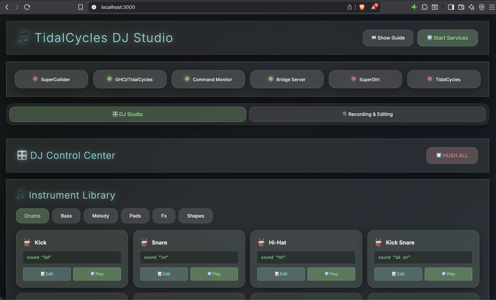
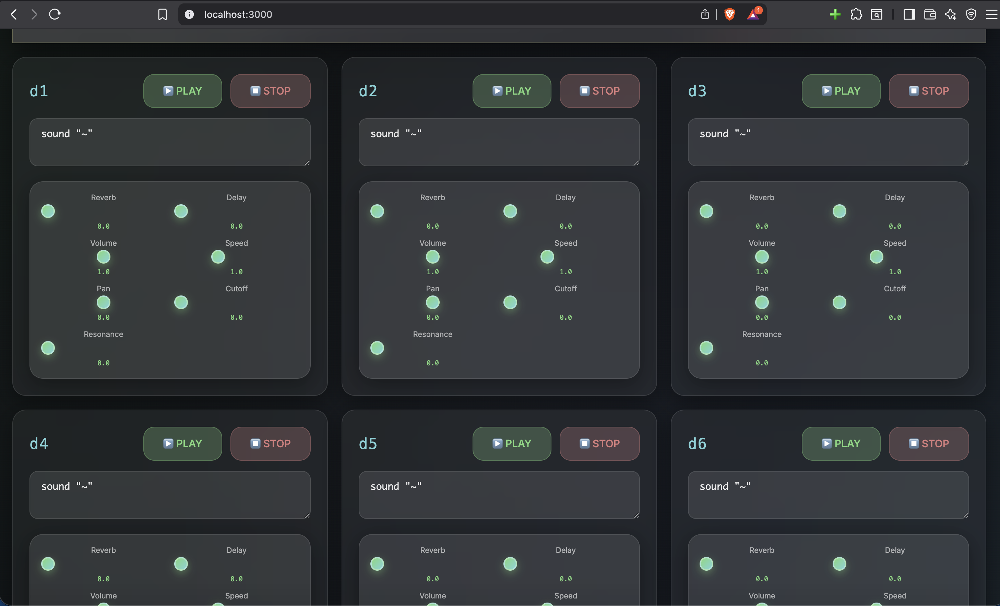
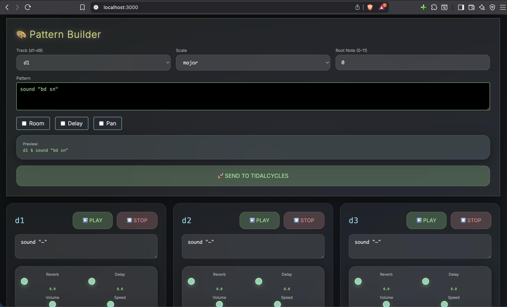
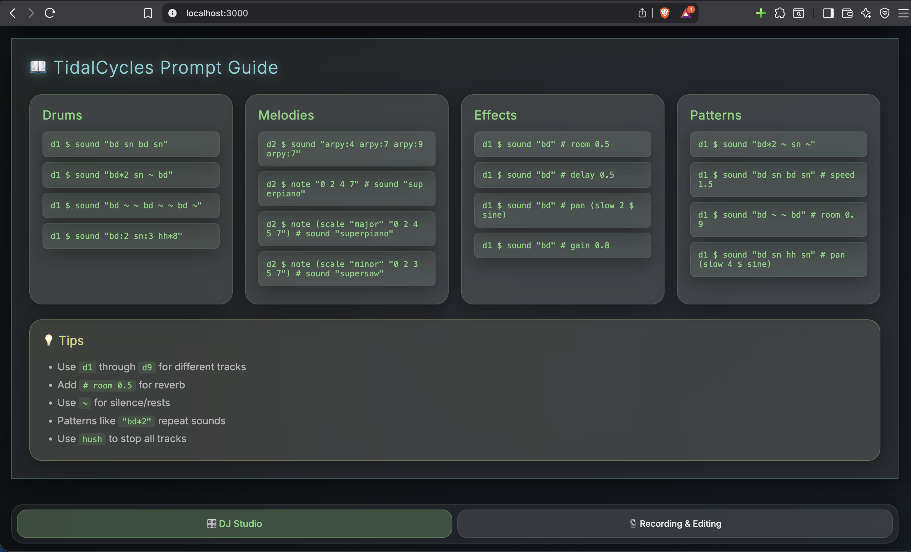
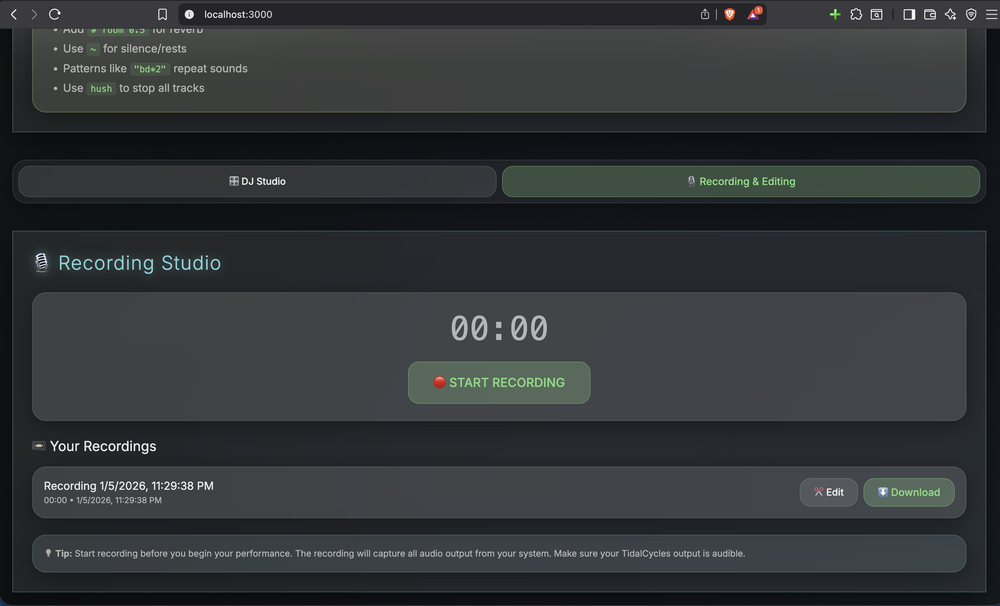
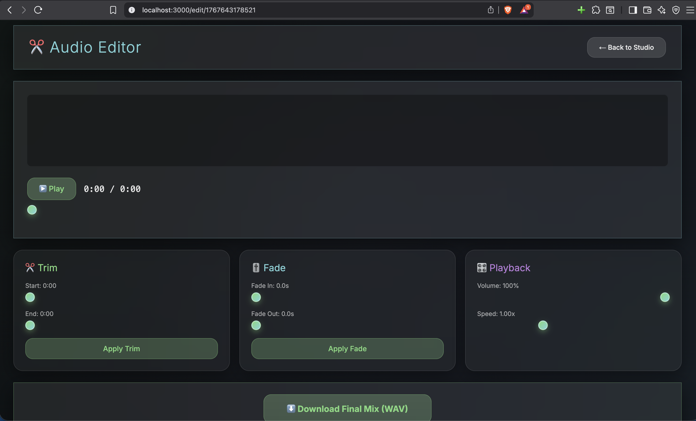

# 🎵 TidalCycles DJ Control Center

<div align="center">

A powerful web-based DJ interface for **TidalCycles** live coding music. Control TidalCycles through an intuitive UI with instruments, pattern builders, real-time effects, and audio recording.

### 📺 Full Tutorial


[](https://tidalcycles.org/)
[](https://nextjs.org/)
[](https://python.org/)
[](LICENSE)

**Created by [Amirhosein Tahmasbzadeh](https://github.com/amirhoseintahmasb)**

</div>

---

## 🖼️ Screenshots

### DJ Control Center
The main interface with instrument library and track controls.



### Instrument Library
Pre-built sounds organized by category: Drums, Bass, Melody, Pads, FX, and Shapes.



### Pattern Builder
Create custom patterns with scale selection, effects, and live preview.



### Prompt Guide
Interactive TidalCycles syntax reference with one-click examples.



### Recording Studio
Record your live sessions in real-time.



### Audio Editor
Trim, fade, adjust volume and export your recordings.



---

## ✨ Features

| Feature | Description |
|---------|-------------|
| 🎛️ **DJ Control Center** | Visual interface for TidalCycles with 9 tracks |
| 🎹 **Instrument Library** | 40+ preset sounds: Drums, Bass, Melody, Pads, FX |
| 🎨 **Pattern Builder** | Build patterns with scales, effects, and live preview |
| 📚 **Prompt Guide** | Learn TidalCycles syntax with clickable examples |
| 🎚️ **Track Controls** | Individual volume, mute, effects per track |
| 🎙️ **Recording Studio** | Record sessions directly from the browser |
| ✂️ **Audio Editor** | Trim, fade in/out, volume, speed adjustment |
| 💾 **Export** | Download recordings as WAV files |

---

## 🏗️ Architecture

```
┌─────────────────┐     ┌──────────────────┐     ┌─────────────────┐
│   Next.js UI    │────▶│  Python Service  │────▶│  Command File   │
│  (localhost:3000)│     │  (localhost:9000) │     │ (.ghci-commands)│
└─────────────────┘     └──────────────────┘     └────────┬────────┘
                                                          │
                                                          ▼
┌─────────────────┐     ┌──────────────────┐     ┌─────────────────┐
│  SuperCollider  │◀────│     GHCi +       │◀────│ Monitor Script  │
│   (SuperDirt)   │     │   TidalCycles    │     │   (Python)      │
└─────────────────┘     └──────────────────┘     └─────────────────┘
```

---

## 📋 Prerequisites

| Requirement | Version | Purpose |
|-------------|---------|---------|
| [TidalCycles](https://tidalcycles.org/docs/getting-started/installation) | 1.10+ | Live coding language |
| [SuperCollider](https://supercollider.github.io/) | 3.12+ | Audio engine |
| [SuperDirt](https://github.com/musikinformatik/SuperDirt) | 1.7+ | TidalCycles synth |
| [GHCi](https://www.haskell.org/ghc/) | 9.0+ | Haskell interpreter |
| [Node.js](https://nodejs.org/) | 18+ | Frontend runtime |
| [Python](https://python.org/) | 3.8+ | Backend service |

---

## 🚀 Quick Start

### 1️⃣ Start SuperCollider

Open **SuperCollider** and run the boot script:

```supercollider
// Open: scripts/supercollider/boot-superdirt.scd
// Select all and press Cmd+Enter
```

Wait for: `✅ SuperDirt is ready! Listening on port 57120`

### 2️⃣ Start GHCi with TidalCycles

Open **Terminal.app** (macOS):

```bash
ghci -XOverloadedStrings -ghci-script ~/.cabal/share/*/tidal-*/BootTidal.hs
```

Wait for `tidal>` prompt and "Connected to SuperDirt."

### 3️⃣ Start the Backend Service

```bash
cd AICODEUR
python3 tidal-service.py
```

### 4️⃣ Start the Command Monitor

```bash
cd AICODEUR
python3 monitor-commands.py
```

### 5️⃣ Start the UI

```bash
cd AICODEUR/dj-ui
npm install
npm run dev
```

### 6️⃣ Open & Play! 🎵

1. Open http://localhost:3000
2. **Keep Terminal.app with GHCi in front**
3. Click instrument buttons to play sounds!

---

## 📁 Project Structure

```
AICODEUR/
├── 📄 README.md              # Documentation
├── 📄 LICENSE                # MIT License
├── 📁 images/                # Screenshots
├── 📁 dj-ui/                 # Next.js Frontend
│   ├── 📁 app/              
│   │   ├── page.tsx         # Main page
│   │   ├── globals.css      # Ambient glass UI styles
│   │   └── edit/[id]/       # Audio editor page
│   └── 📁 components/       
│       ├── DJStudio.tsx     # Main DJ interface
│       ├── InstrumentLibrary.tsx  # Sound presets
│       ├── PatternBuilder.tsx     # Pattern creator
│       ├── TrackControl.tsx       # Track controls
│       ├── EffectPanel.tsx        # Effects panel
│       ├── PromptGuide.tsx        # Syntax help
│       └── RecordingStudio.tsx    # Recording
├── 📁 scripts/
│   ├── 📁 shell/            # Bash scripts
│   └── 📁 supercollider/    # SC boot scripts
├── 📁 examples/             # TidalCycles patterns
├── 🐍 monitor-commands.py   # UI → GHCi bridge
└── 🐍 tidal-service.py      # REST API service
```

---

## 🎹 TidalCycles Cheat Sheet

### Basic Patterns
```haskell
d1 $ sound "bd sn bd sn"        -- Kick snare loop
d1 $ sound "hh*8"               -- 8 hi-hats per cycle
d1 $ sound "arpy:0 arpy:4 arpy:7"  -- Arpeggio
```

### Speed & Time
```haskell
d1 $ fast 2 $ sound "bd sn"     -- 2x faster pattern
d1 $ slow 4 $ sound "pad"       -- 4x slower (ambient)
d1 $ sound "bd" # speed 1.5     -- Pitch up
d1 $ sound "bd" # speed 0.5     -- Pitch down
```

### Effects
```haskell
d1 $ sound "bd" # room 0.8      -- Reverb
d1 $ sound "bd" # delay 0.5     -- Delay
d1 $ sound "bd" # pan sine      -- Auto-pan
d1 $ sound "bd" # gain 0.7      -- Volume
d1 $ sound "bd" # cutoff 1000   -- Low-pass filter
```

### Scales & Melodies
```haskell
d1 $ note (scale "major" "0 2 4 5 7") # sound "superpiano"
d1 $ note (scale "minor" "0 2 3 5 7") # sound "supersaw"
d1 $ note (scale "pentatonic" "0 1 2 3 4") # sound "pluck"
```

### Control
```haskell
d1 $ silence                    -- Stop track 1
hush                            -- Stop everything
solo 1                          -- Solo track 1
```

---

## ⚙️ Configuration

### API Ports
| Service | Default Port |
|---------|-------------|
| UI (Next.js) | 3000 |
| Python Service | 9000 |
| TidalCycles OSC | 6010 |
| SuperDirt | 57120 |

### Custom UI Port
```bash
npm run dev -- -p 3001
```

---

## 🔧 Troubleshooting

### ❌ No Sound

1. ✅ SuperCollider running with SuperDirt?
2. ✅ GHCi shows "Connected to SuperDirt"?
3. ✅ Test: `d1 $ sound "bd"` in GHCi

### ❌ UI Buttons Don't Work

1. ✅ `monitor-commands.py` running?
2. ✅ Terminal.app with GHCi in **front**?
3. ✅ Accessibility permission for Terminal:
   - System Settings → Privacy & Security → Accessibility → Terminal ✓

### ❌ Commands Garbled

- Keep GHCi Terminal in front
- Wait for `tidal>` prompt before clicking

---

## 🛠️ Tech Stack

| Layer | Technology |
|-------|------------|
| Frontend | Next.js 14, React, TypeScript |
| Styling | CSS Variables, Glass Morphism |
| Backend | Python 3, HTTP Server |
| Bridge | AppleScript, Clipboard Paste |
| Audio | TidalCycles, SuperCollider, SuperDirt |

---

## 📜 License

MIT License © 2026 [Amirhosein Tahmasbzadeh](https://github.com/amirhoseintahmasb)

See [LICENSE](LICENSE) for details.

---

## 🙏 Acknowledgments

- [TidalCycles](https://tidalcycles.org/) - Alex McLean & community
- [SuperCollider](https://supercollider.github.io/) - Audio synthesis
- [SuperDirt](https://github.com/musikinformatik/SuperDirt) - Julian Rohrhuber

---

<div align="center">

**Made with ❤️ for live coding musicians**

[⭐ Star this repo](https://github.com/amirhoseintahmasb/tidal-dj) if you find it useful!

</div>
